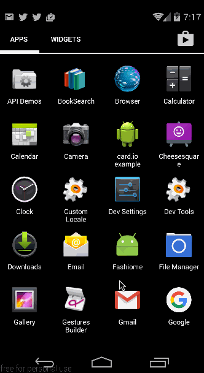

# ModaRenta
## Basic Walkthrough - Sprint1

Here's a walkthrough of implemented user stories:

GIF created with [LiceCap](http://www.cockos.com/licecap/).

* [ ] Setup Parse for ModaRenta
* [ ] Integrate Facebook login
* [ ] Create models and relationships
* [ ] List dummy results in Home page
* [ ] On click take the user to details page of the product
* [ ] Design data structure
* [ ] Create screen mockups
* [ ] Detail page has the following
	* [ ] Meta data of the item
	* [ ] Map snapshot
	* [ ] Dummy Product reviews
	* [ ] Dummy suggestions
* [ ] Map should point all the results
* [ ] Horizontal scroller to go through meta data
* [ ] Swiping right or left should change the result in focus and change the marker on the map
* [ ] Clicking on the marker on the map or the Horizontal scroller item should take the user to details page
* [ ] Toggle between list view and map view.
